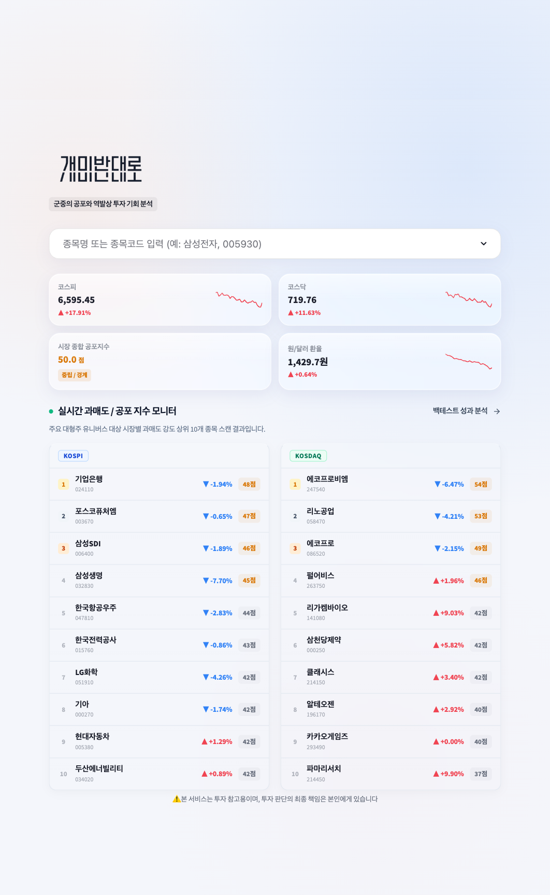
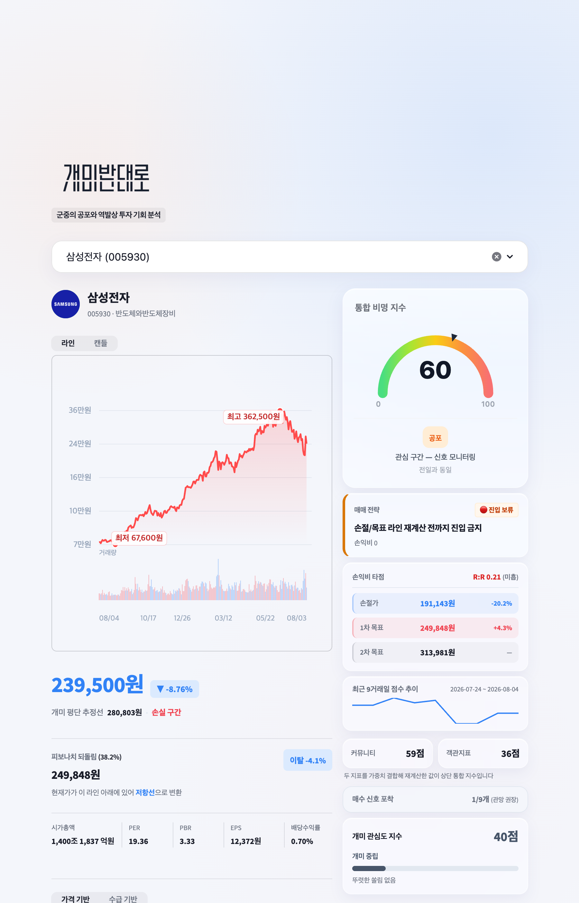
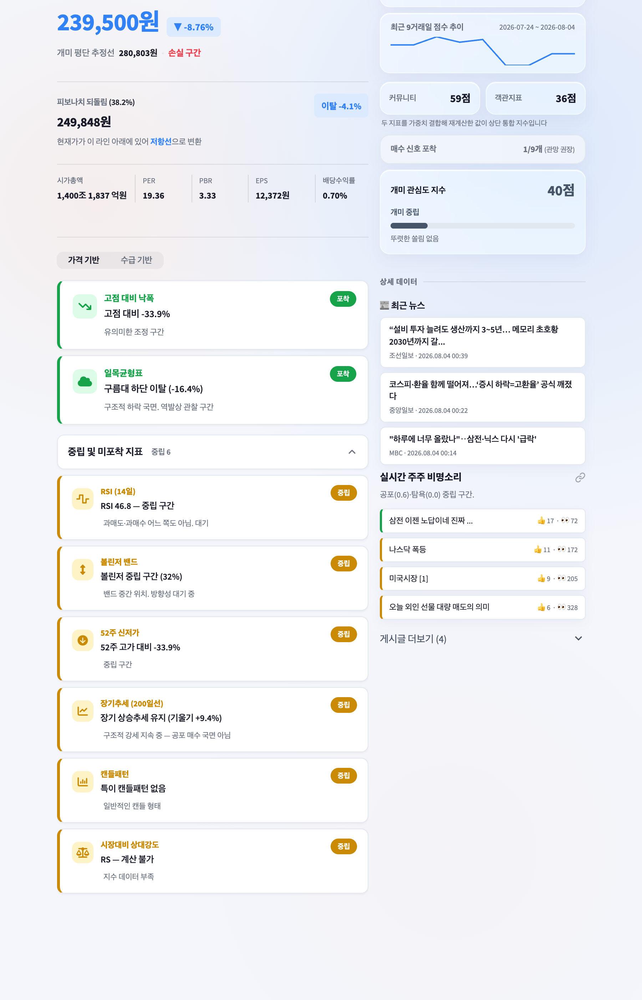
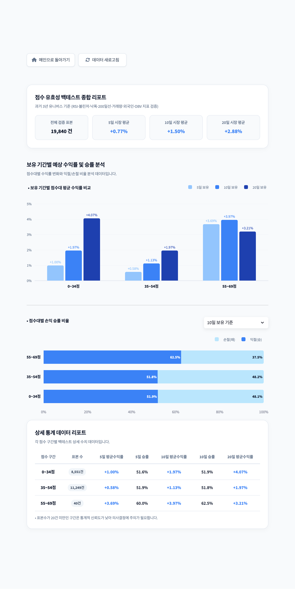
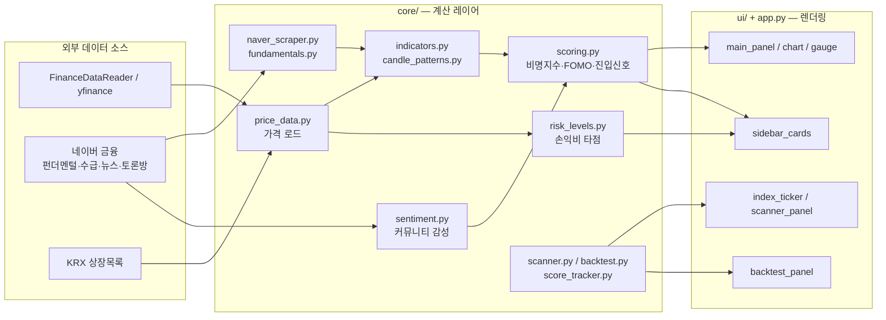

# 개미반대로 (Ant-Contra)

> 커뮤니티 여론의 공포/탐욕과 기술적 지표를 교차검증해 역발상 매수 타이밍을 찾는 실시간 주식 대시보드

### 🌐 프로젝트 산출물 & 명세서 포털 (Live Web)

> 채용 담당자 및 면접관을 위해 작성된 시스템 아키텍처 및 설계 명세서 웹사이트입니다.  
> 🔗 **실시간 문서 포털 바로가기:** [통합포털](https://jh0764.github.io/ant-contra/)  
> _(또는 GitHub 내 소스 문서 바로가기: [`docs/index.html`](./docs/index.html))_

---

## 📖 시스템 주요 명세서 (System Specifications)

| 문서명                               | 설명                                                    |                                    웹 문서 링크                                     |                                   소스 파일                                   |
| :----------------------------------- | :------------------------------------------------------ | :---------------------------------------------------------------------------------: | :---------------------------------------------------------------------------: |
| **문서 통합 포털**                   | 전체 명세서 및 아키텍처 대문 페이지                     |                 [웹에서 보기](https://jh0764.github.io/ant-contra/)                 |                       [`index.html`](./docs/index.html)                       |
| **시스템 아키텍처 정의서**           | 계층 구조, System Context, 데이터 소스 이중화(Fallback) |        [웹에서 보기](https://jh0764.github.io/ant-contra/architecture.html)         |                [`architecture.html`](./docs/architecture.html)                |
| **데이터 수집 및 파이프라인 명세서** | 외부 데이터 수집, 캐싱 정책(TTL), 장애 대응 전략        | [웹에서 보기](https://jh0764.github.io/ant-contra/data_pipeline_specification.html) | [`data_pipeline_specification.html`](./docs/data_pipeline_specification.html) |
| **요구사항 정의서**                  | 시스템 유즈케이스, 비명 지수 산출 로직 요구사항         |      [웹에서 보기](https://jh0764.github.io/ant-contra/requirements_spec.html)      |           [`requirements_spec.html`](./docs/requirements_spec.html)           |
| **백테스트 성과 검증 보고서**        | 과거 3년 데이터 기준 점수구간별 승률/수익률 검증        | [웹에서 보기](https://jh0764.github.io/ant-contra/backtest_verification_spec.html)  |  [`backtest_verification_spec.html`](./docs/backtest_verification_spec.html)  |
| **지표·전략 및 트러블슈팅**          | 13개 지표 가중치 설계 및 기술적 한계 극복 사례          |  [웹에서 보기](https://jh0764.github.io/ant-contra/strategy_troubleshooting.html)   |    [`strategy_troubleshooting.html`](./docs/strategy_troubleshooting.html)    |
| **테스트 계획 보고서**               | 단위 테스트, 통합 테스트 및 데이터 파이프라인 검증 계획 |      [웹에서 보기](https://jh0764.github.io/ant-contra/test_plan_report.html)       |            [`test_plan_report.html`](./docs/test_plan_report.html)            |

## 💡 프로젝트 개요

국내 개인투자자(개미)는 감정적 매매(패닉셀·FOMO)에 취약하지만, 커뮤니티 여론과 실제 기술지표를 직접 교차검증할 시간과 툴이 없습니다. **개미반대로**는 네이버 종목토론방의 공포/탐욕 여론을 정량화하고, RSI·볼린저밴드·거래량·외국인수급 등 13개 객관 지표와 결합해 하나의 **"비명 지수(Scream Index)"**로 요약해 보여줍니다.

---

## 🖼️ 스크린샷

### 홈 — 실시간 시장 티커 + 과매도 스캐너



### 종목 상세 — 비명지수 게이지 · 13개 지표 · 손익비 타점




### 백테스트 — 점수구간별 승률/수익률 검증



_(실제 화면 캡처는 `docs/screenshots/`에 추가)_

---

## ✨ 핵심 기능

- **실시간 시장 티커**: 코스피/코스닥 지수, 원/달러 환율, 시장 종합 공포지수를 스파크라인과 함께 표시
- **과매도 스캐너**: 대형주 유니버스(KOSPI 30 / KOSDAQ 10) 대상 objective_score 상위 종목 자동 스캔
- **통합 비명 지수**: 52주 위치 · RSI · 드로다운 조합의 base score + 수급/거래량/커뮤니티 가중치 adjustment로 0~100점 산출
- **13개 객관 지표**: RSI(14), 볼린저밴드, 52주 신저가/고가 근접도, 고점대비 낙폭, 200일선 장기추세(눌림목 vs 낙폭과대 구분), 캔들패턴 인식, 일목균형표 구름대, 거래량+거래대금 결합, OBV 다이버전스, 외국인 순매수, 공포-거래량 괴리(PVD), 뉴스 공백지수, 시장대비 상대강도(RS)
- **커뮤니티 감성분석**: 네이버 종목토론방 게시글을 자체 공포/탐욕 사전으로 스코어링, ATR 변동성 과열 시 커뮤니티 비중 자동 축소
- **FOMO 지수**: 개인 순매수 급증도로 추격매수 과열 여부 판단
- **손익비 타점**: 볼린저·피보나치·ATR 기반 손절가/1·2차 목표가와 R:R 비율 자동 계산
- **점수 이력 트래킹**: 종목별 일별 점수를 저장해 전일 대비 변화 추적
- **백테스트 검증**: 과거 3년 유니버스 대상 시점별 재계산(미래데이터 유출 방지)으로 점수구간별 forward return·승률 검증

---

## 🏗️ 아키텍처



**데이터 흐름 요약**: 가격/펀더멘털/수급/토론방 데이터를 각 소스별로 수집 → `indicators.py`가 13개 지표를 병렬 계산 → `sentiment.py`가 커뮤니티 텍스트를 정량화 → `scoring.py`가 이 둘을 결합해 최종 비명 지수·진입 신호를 산출 → UI 레이어가 게이지/카드/차트로 렌더링.

---

## 🛠️ 기술 스택

| 영역       | 기술                                                 |
| ---------- | ---------------------------------------------------- |
| 프레임워크 | Streamlit                                            |
| 데이터     | FinanceDataReader, yfinance, pandas, numpy           |
| 스크래핑   | requests, BeautifulSoup4                             |
| 차트       | Plotly, 커스텀 SVG(JS)                               |
| 캐싱       | `st.cache_data` (TTL 5분~12시간)                     |
| 영속화     | JSON 파일 기반 점수 이력 (`data/score_history.json`) |

---

## 📂 폴더 구조

```
src/
├── app.py                 # 진입점, 라우팅, 전체 조립
├── constants.py            # 테마, 색상, 임계값 상수
├── core/                   # 순수 로직 (데이터 → 계산)
│   ├── price_data.py / market_index.py / krx_listing.py
│   ├── naver_scraper.py / fundamentals.py
│   ├── indicators.py / candle_patterns.py / price_levels.py
│   ├── sentiment.py / scoring.py / risk_levels.py
│   └── scanner.py / backtest.py / score_tracker.py
└── ui/                      # 렌더링
    ├── index_ticker.py / scanner_panel.py
    ├── main_panel.py / chart.py / gauge.py
    ├── sidebar_cards.py / ticker_badge.py
    ├── backtest_panel.py / landing.py / common.py
data/
├── score_history.json
└── view_counts.json
```

---

## 🚀 설치 및 실행

```bash
git clone <repo-url>
cd <repo-name>
pip install -r requirements.txt
streamlit run src/app.py
```

로컬 실행 후 `http://localhost:8501` 접속. 검색창에 종목명/코드 입력 시 상세 대시보드 진입, `?view=backtest`로 백테스트 페이지 접근 가능.

---

## 📊 백테스트 검증

과거 3년 KOSPI/KOSDAQ 유니버스 기준 시점별 재계산(look-ahead bias 방지)으로 검증한 결과입니다. (표본수는 스캔 시점 데이터 갱신에 따라 변동)

| 점수구간 | 5일 평균수익률 | 5일 승률 | 10일 평균수익률 | 10일 승률 |
| -------- | -------------- | -------- | --------------- | --------- |
| 0~34점   | +1.01%         | 51.6%    | +1.98%          | 51.9%     |
| 35~54점  | +0.61%         | 52.1%    | +1.16%          | 51.9%     |
| 55~69점  | +3.69%         | 60.0%    | +3.97%          | 62.5%     |

> 표본수 20건 미만 구간은 통계적 신뢰도가 낮아 참고용으로만 활용. 상세 리포트는 앱 내 `백테스트 성과 분석` 메뉴 참고.

---

## ⚠️ 알려진 한계

- 네이버 금융 비공식 스크래핑 기반 — 마크업 변경 시 해당 지표만 조용히 폴백(앱 크래시는 방지되나 정확도 저하 가능)
- 점수 이력이 JSON 파일 기반이라 ephemeral 배포 환경(예: Streamlit Cloud)에서는 재배포 시 유실 가능 → 추후 SQLite/외부 DB 전환 검토
- 스캔 유니버스가 40종목으로 고정 하드코딩되어 있음
- 테스트 코드 미비 (core/ 순수 함수 위주로 pytest 도입 예정)

---

## 📄 관련 문서

- [`PRD_개미반대로.md`](./PRD_개미반대로.md) — 상세 기능 명세
- [`DESIGN.md`](./DESIGN.md) — 디자인 시스템 토큰
- [`PRODUCT.md`](./PRODUCT.md) — 제품 포지셔닝/브랜드 원칙

---

## ⚠️ 투자 유의사항

본 서비스는 투자 참고용이며, 투자 판단의 최종 책임은 사용자 본인에게 있습니다.

## 📝 License

TBD
